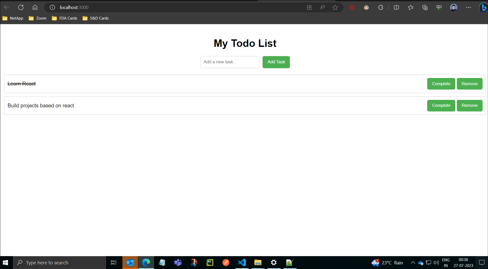

# Todo List App

## Description

The Todo List App is a simple React application that allows users to create, manage, and track their daily tasks. Users can add new tasks, mark tasks as completed, and remove tasks from the list.

## How It Works

1. **Add a New Task**: To add a new task, type the task description in the input field and click the "Add Task" button. The new task will be added to the list.

2. **Complete a Task**: When a task is completed, click the "Complete" button next to the task. The task will be marked as completed, and its appearance will change to indicate completion.

3. **Remove a Task**: To remove a task from the list, click the "Remove" button next to the task. The task will be removed from the list.

## What I Learned in React

While building this Todo List App using React, I gained a solid understanding of some key concepts and features in React:

1. **Components**: I learned how to create functional components in React and how to compose a user interface using reusable components.

2. **State Management**: I learned how to use React's `useState` hook to manage state within functional components. State management is essential for keeping track of the list of tasks and their completion status.

3. **Props**: I utilized props to pass data and functions between parent and child components, enabling communication and sharing data throughout the application.

4. **Rendering and Reconciliation**: I discovered how React's Virtual DOM works, allowing for efficient updates and rendering only the necessary changes to the actual DOM.

5. **Event Handling**: I practiced handling events like form submissions, button clicks, and input changes, enabling user interactions in the application.

6. **Conditional Rendering**: I implemented conditional rendering to display different components or styles based on the state of the tasks (e.g., marking a task as completed).

7. **Styling**: While not a core React concept, I used CSS to style the components and create a visually appealing user interface.

Overall, building the Todo List App provided me with a hands-on experience in React development, solidifying my knowledge of React's fundamental concepts and empowering me to create functional and interactive user interfaces.

## Getting Started

To run the Todo List App on your local machine:

1. Clone this repository to your computer.
2. Navigate to the project directory in your terminal.
3. Install the necessary dependencies by running `npm install`.
4. Start the development server with `npm start`.
5. Open your browser and visit `http://localhost:3000` to view the app.

## Technologies Used

- React
- JavaScript
- HTML
- CSS

## License

This project is licensed under the MIT License - see the [LICENSE](LICENSE) file for details.

Feel free to use, modify, and distribute this project as per the terms of the MIT License.

---
Thank you for checking out my Todo List App! If you have any questions or suggestions, please feel free to reach out. Happy coding!